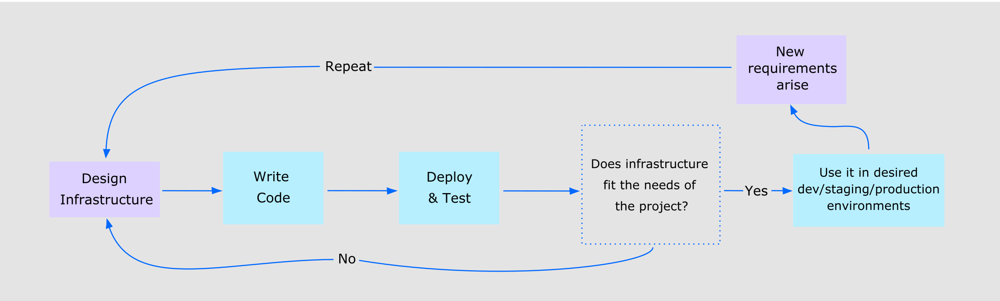

# terraform-do-droplets

Structure:

```
.
└── tf/
    ├── front-end-project
        ├── versions.tf
        ├── variables.tf
        ├── provider.tf
        ├── droplets.tf
        ├── data-sources.tf
        └── external/
            └── name-generator.py
```

# Pre requisites.

Install Terraform cli:

- https://learn.hashicorp.com/tutorials/terraform/install-cli

# Getting started.

Start by defining your personal access token as environment variables, so you won’t have to copy the values each time you run Terraform. Run the following commands, replacing the highlighted ("") values:

```
    export DO_PAT="your_do_token"
    export DO_SSH_KEY_NAME="your_ssh_key_name"
```

You can find your API token in your DigitalOcean Control Panel. (https://cloud.digitalocean.com/account/security)

Go to the project root directory and init terraform to download libs and resources.

```
terraform init

```

With this, you are ready to run the plan and apply command.

## front-end-project

Go to the front-end-project directory and run the following commands:

Run the plan command with the variable values passed in to see what steps Terraform would take to deploy your project:

```
    terraform plan -var "do_token=${DO_PAT}" -var "ssh_key_name=${DO_SSH_KEY_NAME}"
```

The Run the apply command with the variable values passed by environment and allow Terraform deploy your project:

```
    terraform apply -var "do_token=${DO_PAT}" -var "ssh_key_name=${DO_SSH_KEY_NAME}"
```

This will create:

    - A droplet for polkascan project.
    - A droplet for polkadotjs project.
    - A project named dev-front-end
    - Move droplets to the dev-front-end project.

# Infraestructure as code.

IaC, being based on code, should always be coupled with version control software (VCS), such as Git. Storing your infrastructure declarations in VCS makes it easily retrievable, with changes visible to everyone on your team, and provides snapshots at historical points, so you can always roll back to an earlier version if new modifications create errors. Advanced VCS can be configured to automatically trigger the IaC tool to update the infrastructure in the cloud when an approved change is added.



Check the following links to learn more.

# Tutorials.

- https://www.digitalocean.com/community/tutorial_series/how-to-manage-infrastructure-with-terraform
